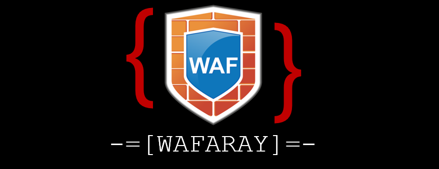
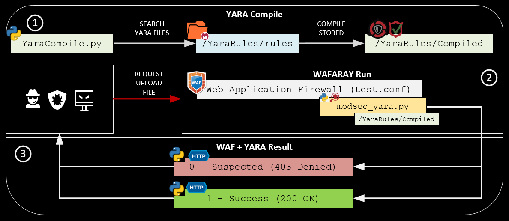
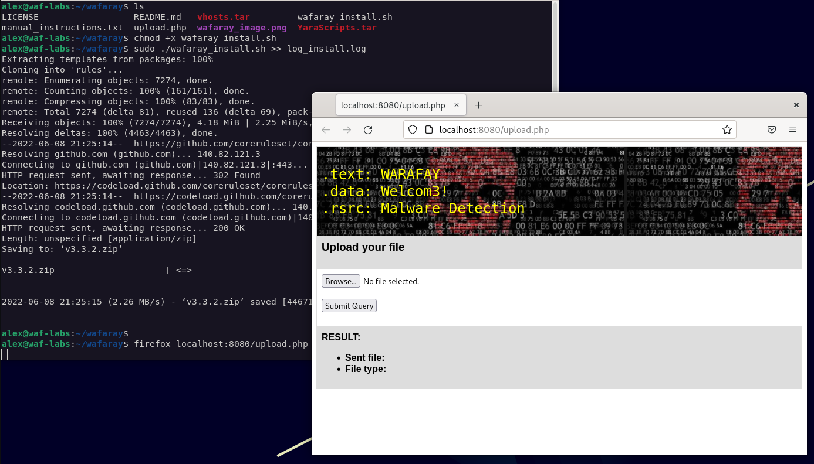
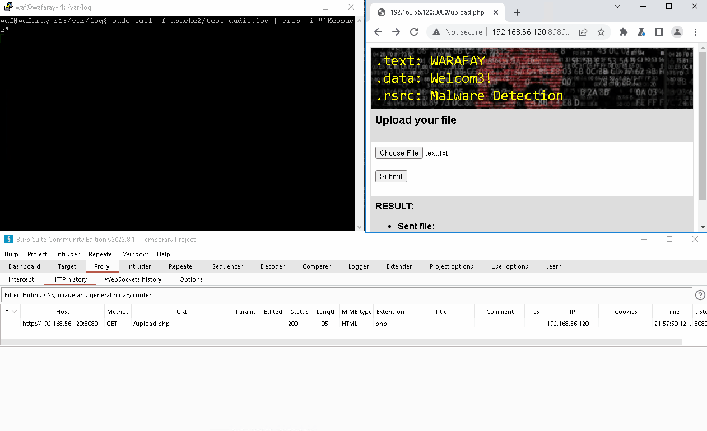
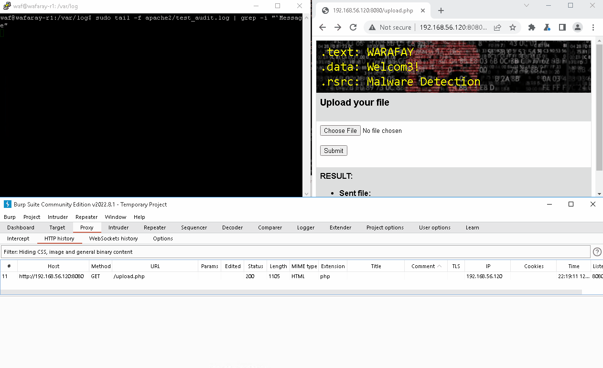
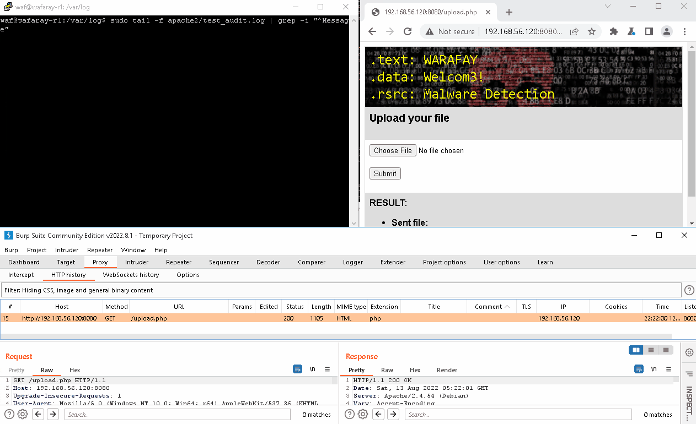

# Enhance your malware detection with WAF + YARA (WAFARAY)

<h1 align="center">
<a>
  
</a>
</h1>

#### WAFARAY is a LAB deployment based on Debian 11.3.0 (stable) x64 made and cooked between two main ingredients WAF + YARA to detect malicious files (*e.g. webshells, virus, malware, binaries*) typically trough web functions (upload files).

[](https://docs.python.org/3/download.html)
[](https://www.gnu.org/software/bash/)
[](https://github.com)
[](https://svgshare.com/i/Zhy.svg)
<a href="https://github.com/alt3kx/wafaray/blob/main/LICENSE"></a>
<a href="https://github.com/alt3kx/wafaray/releases"> </a>
  
## Purpose 
In essence, the main idea came to use WAF + YARA (YARA right-to-left = ARAY) to detect malicious files at the WAF level before WAF can forward them to the backend e.g. files uploaded through web functions see: https://owasp.org/www-community/vulnerabilities/Unrestricted_File_Upload

When a web page allows uploading files, most of the WAFs are not inspecting files before sending them to the backend. Implementing WAF + YARA could provide malware detection before WAF forwards the files to the backend.

### Do malware detection through WAF?
Yes, one solution is to use ModSecurity + Clamav, most of the pages call ClamAV as a process and not as a daemon, in this case, analysing a file could take more than 50 seconds per file. See this resource: https://kifarunix.com/intercept-malicious-file-upload-with-modsecurity-and-clamav/ 

### Do malware detection trough WAF + YARA?
:-( A few clues here [Black Hat Asia 2019](https://portswigger.net/daily-swig/waf-reloaded-modsecurity-3-1-showcased-at-black-hat-asia) please continue reading and see below our quick LAB deployment.

## WAFARAY: how does it work ?
Basically, It is a quick deployment **(1)** with pre-compiled and ready-to-use YARA rules via ModSecurity (WAF) using a custom rule; **(2)** this custom rule will perform an inspection and detection of the files that might contain malicious code, **(3)** typically web functions (upload files) if the file is suspicious will reject them receiving a 403 code Forbidden by ModSecurity.

<h1 align="center">
<a>
  
</a>
</h1>

:heavy_check_mark: The `YaraCompile.py` compiles all the yara rules. (Python3 code) </br>
:heavy_check_mark: The `test.conf` is a virtual host that contains the mod security rules.  (ModSecurity Code) </br>
:heavy_check_mark: ModSecurity rules calls the `modsec_yara.py` in order to inspect the file that is trying to upload. (Python3 code) </br>
:heavy_check_mark: Yara returns two options 1 (200 OK) or 0 (403 Forbidden)

### Main Paths:

* Yara Compiled rules: `/YaraRules/Compiled`
* Yara Default rules: `/YaraRules/rules`
* Yara Scripts: `/YaraRules/YaraScripts`
* Apache vhosts: `/etc/apache2/sites-enabled`
* Temporal Files: `/temporal` </br>

### Approach
* `Blueteamers`: Rule enforcement, best alerting, malware detection on files uploaded trough web functions.
* `Redteamers/pentesters`: GreyBox scope , upload and bypass with a malicious file, rule enforcement.
* `Security Officers`: Keep alerting, threat hunting.
* `SOC`: Best monitoring about malicious files.
* `CERT`: Malware Analysis, Determine new IOC.

## Building Detection Lab
The Proof of Concept is based on Debian 11.3.0 (stable) x64 OS system, OWASP CRC v3.3.2 and Yara 4.0.5, you will find the automation scripts here `wafaray_install.sh` and manual installation as optional can be found here: `manual_instructions.txt` also has been created a PHP page as "mock" to observe the interaction and detection of malicious files using WAF + YARA.

### Installation *(recommended)* with shell scripts
:heavy_check_mark: Step 1: Download Debian 11.3.0: https://cdimage.debian.org/debian-cd/current/amd64/iso-dvd/debian-11.3.0-amd64-DVD-1.iso </br>
:heavy_check_mark: Step 2: Deploy using VMware or VirtualBox </br>
:heavy_check_mark: Step 3: Once installed, please follow the instructions below: </br>
```ruby
alex@waf-labs:~$ su root 
root@waf-labs:/home/alex#

# Remember to change YOUR_USER by your username (e.g waf)
root@waf-labs:/home/alex# sed -i 's/^\(# User privi.*\)/\1\nalex ALL=(ALL) NOPASSWD:ALL/g' /etc/sudoers
root@waf-labs:/home/alex# exit
alex@waf-labs:~$ sudo sed -i 's/^\(deb cdrom.*\)/#\1/g' /etc/apt/sources.list
alex@waf-labs:~$ sudo sed -i 's/^# \(deb\-src http.*\)/ \1/g' /etc/apt/sources.list
alex@waf-labs:~$ sudo sed -i 's/^# \(deb http.*\)/ \1/g' /etc/apt/sources.list
alex@waf-labs:~$ echo -ne "\n\ndeb http://deb.debian.org/debian/ bullseye main\ndeb-src http://deb.debian.org/debian/ bullseye main\n" | sudo tee -a  /etc/apt/sources.list
alex@waf-labs:~$ sudo apt-get update
alex@waf-labs:~$ sudo apt-get install sudo -y
alex@waf-labs:~$ sudo apt-get install git vim dos2unix net-tools -y
alex@waf-labs:~$ git clone https://github.com/alt3kx/wafaray
alex@waf-labs:~$ cd wafaray
alex@waf-labs:~$ dos2unix wafaray_install.sh
alex@waf-labs:~$ chmod +x wafaray_install.sh
alex@waf-labs:~$ sudo ./wafaray_install.sh >> log_install.log

# Test your LAB environment 
alex@waf-labs:~$ firefox localhost:8080/upload.php
```
<h1 align="center">
<a>
  
</a>
</h1>

### Yara Rules
Once the Yara Rules were downloaded and compiled. 

It is similar to when you deploy ModSecurity, you need to customize what kind of rule you need to apply.
The following log is an example of when the Web Application Firewall + Yara detected a malicious file, in this case, eicar was detected.
```ruby
Message: Access denied with code 403 (phase 2). File "/temporal/20220812-184146-YvbXKilOKdNkDfySME10ywAAAAA-file-Wx1hQA" rejected by 
the approver script "/YaraRules/YaraScripts/modsec_yara.py": 0 SUSPECTED [YaraSignature: eicar] 
[file "/etc/apache2/sites-enabled/test.conf"] [line "56"] [id "500002"] 
[msg "Suspected File Upload:eicar.com.txt -> /temporal/20220812-184146-YvbXKilOKdNkDfySME10ywAAAAA-file-Wx1hQA - URI: /upload.php"]
```

## Tasting WAFARAY... voilà... 

### Stop / Start ModSecurity
```
$ sudo service apache2 stop
$ sudo service apache2 start
```

### Apache Logs
```
$ cd /var/log
$ sudo tail -f apache2/test_access.log apache2/test_audit.log apache2/test_error.log
```
## Demos
:warning: Be careful about your test. The following demos were tested on isolated virtual machines. :warning:

### Demo 1 - EICAR
A malicious file is uploaded, and the ModSecurity rules plus Yara denied uploading file to the backend if the file matched with at least one Yara Rule. (Example of Malware: https://secure.eicar.org/eicar.com.txt) NOT EXECUTE THE FILE.

<h1 align="center">
<a>
  
</a>
</h1>

### Demo 2 - WebShell.php
For this demo, we disable the rule `933110 - PHP Inject Attack` to validate Yara Rules.
A malicious file is uploaded, and the ModSecurity rules plus Yara denied uploading file to the backend if the file matched with at least one Yara Rule. (Example of WebShell PHP: https://github.com/drag0s/php-webshell) NOT EXECUTE THE FILE.

<h1 align="center">
<a>
  
</a>
</h1>

### Demo 3 - Malware Bazaar (RecordBreaker) Published: 2022-08-13
A malicious file is uploaded, and the ModSecurity rules plus Yara denied uploading file to the backend if the file matched with at least one Yara Rule. (Example of Malware Bazaar (RecordBreaker): https://bazaar.abuse.ch/sample/94ffc1624939c5eaa4ed32d19f82c369333b45afbbd9d053fa82fe8f05d91ac2/) NOT EXECUTE THE FILE.

<h1 align="center">
<a>
  
</a>
</h1>

## YARA Rules sources
In case that you want to download more yara rules, you can see the following repositories:
* Yara Signatures Compiled - https://github.com/Yara-Rules/rules
* YARAHub - https://yaraify.abuse.ch/
* Awesome Yara Rules - https://github.com/InQuest/awesome-yara#rules
* Advanced Threat Research Yara Rules - https://github.com/advanced-threat-research/Yara-Rules
* Icewater - https://github.com/SupportIntelligence/Icewater
* Open Source Yara Rules - https://github.com/mikesxrs/Open-Source-YARA-rules
* Bartblaza Yara Rules - https://github.com/bartblaze/Yara-rules
* Cobalstrike - https://github.com/Te-k/cobaltstrike
* Yara Forensic - https://github.com/Xumeiquer/yara-forensics
* Loki - https://github.com/Neo23x0/Loki
* YarGen - https://github.com/Neo23x0/yarGen
* YarAnalyzer - https://github.com/Neo23x0/yarAnalyzer/
* Valhalla - https://www.nextron-systems.com/valhalla/, https://valhalla.nextron-systems.com/
* AlienVault - https://otx.alienvault.com/ (Create an account)

## References
* https://portswigger.net/daily-swig/waf-reloaded-modsecurity-3-1-showcased-at-black-hat-asia
* https://yara.readthedocs.io/en/latest/gettingstarted.html
* https://yara.readthedocs.io/en/v3.4.0/yarapython.html
* https://virustotal.github.io/yara/
* https://www.tutorialspoint.com/perl/perl_introduction.htm
* https://malware.expert/scan-every-file-clam-antivirus-scanner-modsecurity/
* https://xael.org/pages/pyclamd-en.html
* https://docs.clamav.net/
* https://www.decalage.info/en/python/pyclamd
* https://opensource.apple.com/source/clamav/clamav-116.2/clamav.Conf/clamd.conf.auto.html
* https://c99.sh/hunting-0days-with-yara-rules/
* https://github.com/claroty/arya
* https://isc.sans.edu/diary/YARA%27s+Console+Module/28288

## Roadmap until next release

  - [ ] Malware Hash Database <em><a href="https://metacpan.org/pod/MLDBM" rel="nofollow">(MLDBM)</a></em>. The Database stores the MD5 or SHA1 that files were detected as suspicious. 
  - [ ] To be tested <em><a href="https://coreruleset.org/20220919/crs-version-3-3-3-and-3-2-2-covering-several-cves/" rel="nofollow">CRS Modsecurity v.3.3.3</a></em> new rules 
  - [ ] ModSecurity rules improvement to malware detection with Database.
  - [ ] To be created blacklist and whitelist related to MD5 or SHA1.
  - [ ] To be tested, run in background if the Yara analysis takes more than 3 seconds.
  - [ ] To be tested, new payloads, example: Powershell Obfuscasted (WebShells)
  - [ ] Remarks for live enviroments. (WAF AWS, WAF GCP, ...)

## Authors
Alex Hernandez aka <em><a href="https://twitter.com/_alt3kx_" rel="nofollow">(@\_alt3kx\_)</a></em></br>
Jesus Huerta aka <em><a href="https://github.com/mindhack03d" rel="nofollow">@mindhack03d</em> </a>

## Contributors
Israel Zeron Medina aka <em><a href="https://github.com/spk85" rel="nofollow">@spk085</em> </a>


